# MultiPurposeApp - User Flow Chart

**Last Updated**: July 31, 2025  
**Version**: 1.0.0 (MVP)

## Overview

This document provides a comprehensive flowchart of all possible user flows in the MultiPurposeApp, from initial launch to all possible user interactions and navigation paths.

## Main Application Flow

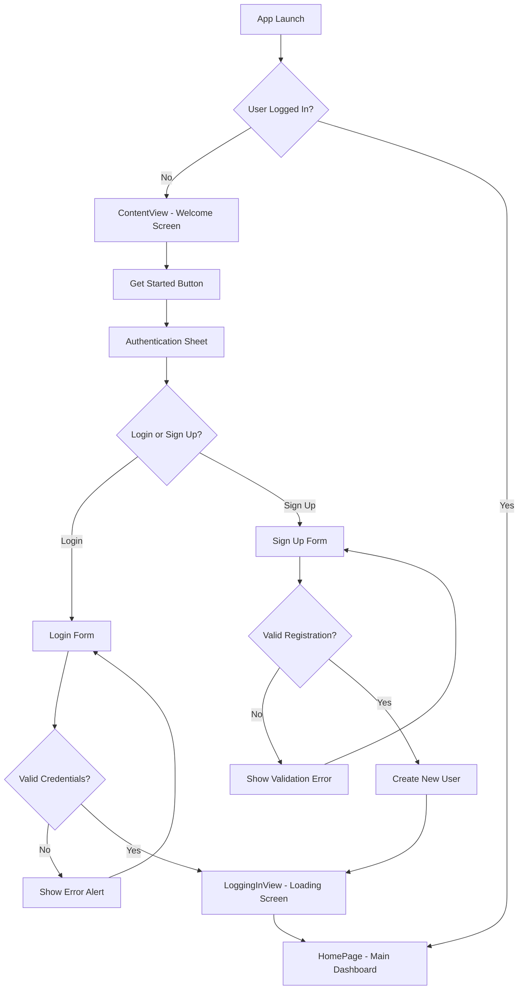

## Authentication Flow

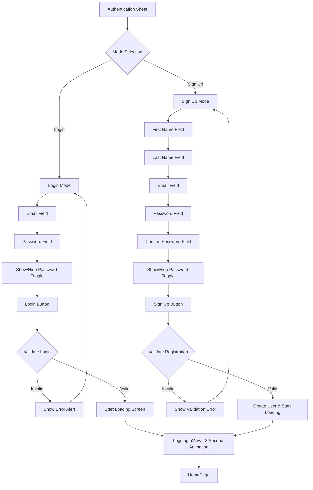

## Main Dashboard Navigation

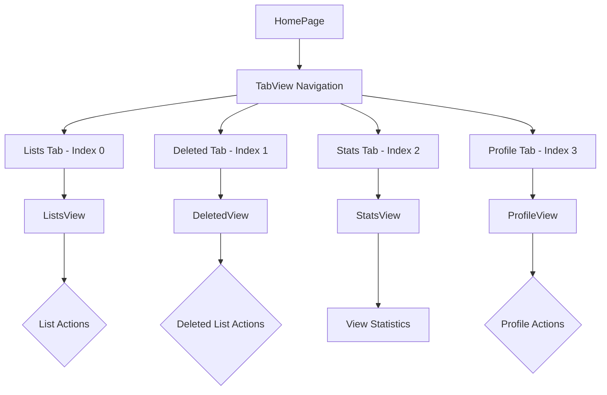

## Lists Management Flow

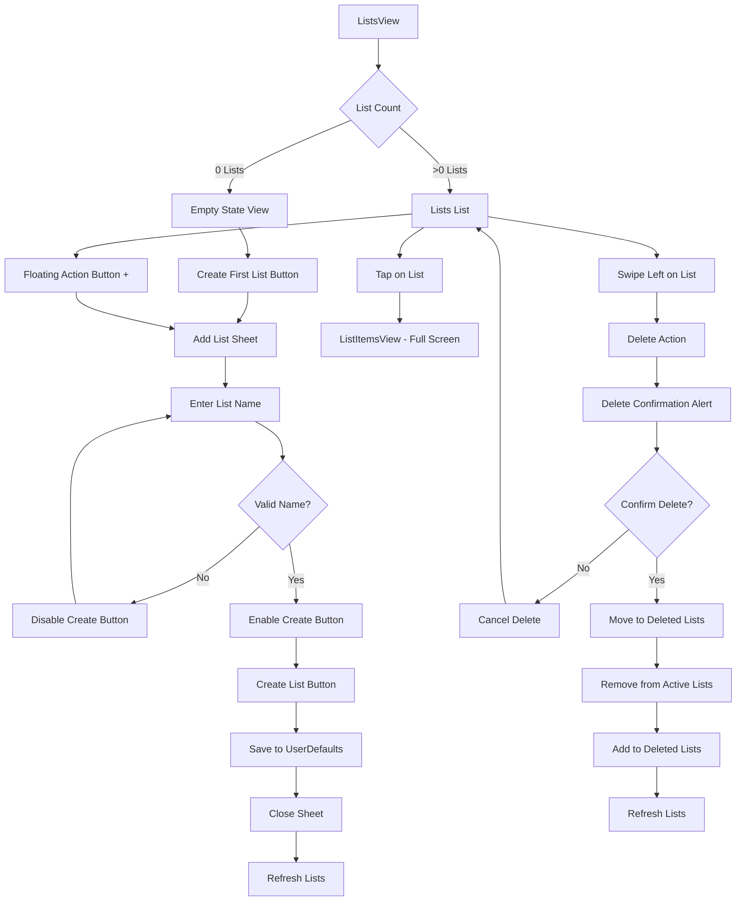

## List Items Management Flow

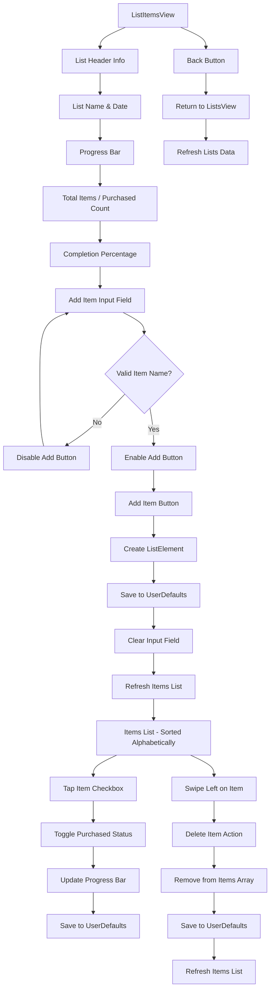

## Deleted Lists Management Flow

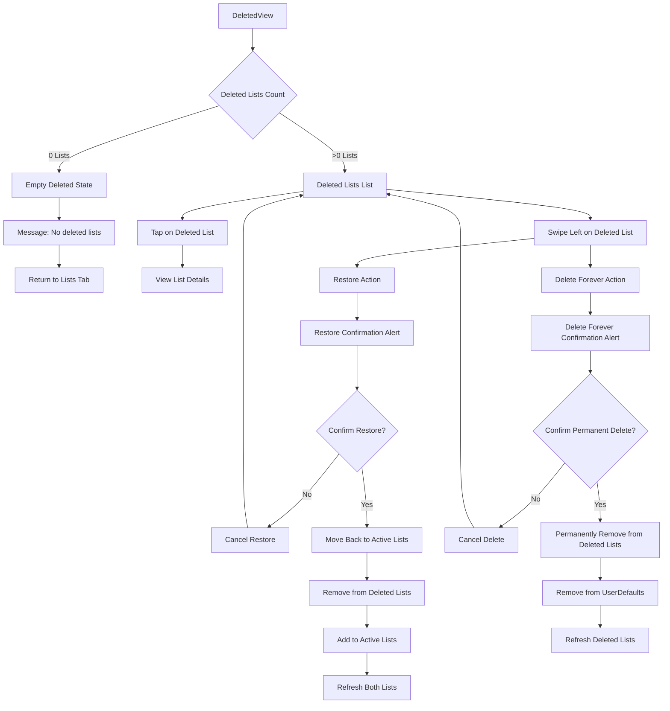

## Statistics Dashboard Flow

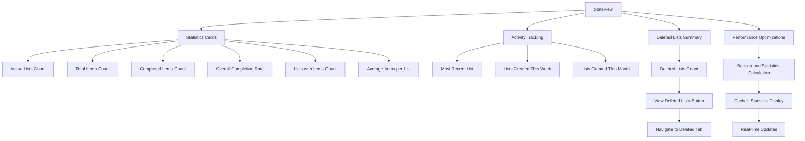

## Profile Management Flow

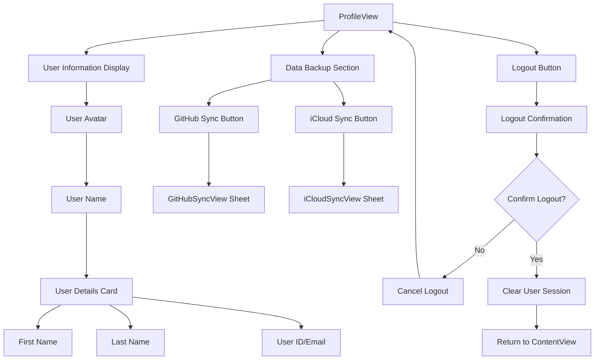

## GitHub Sync Flow

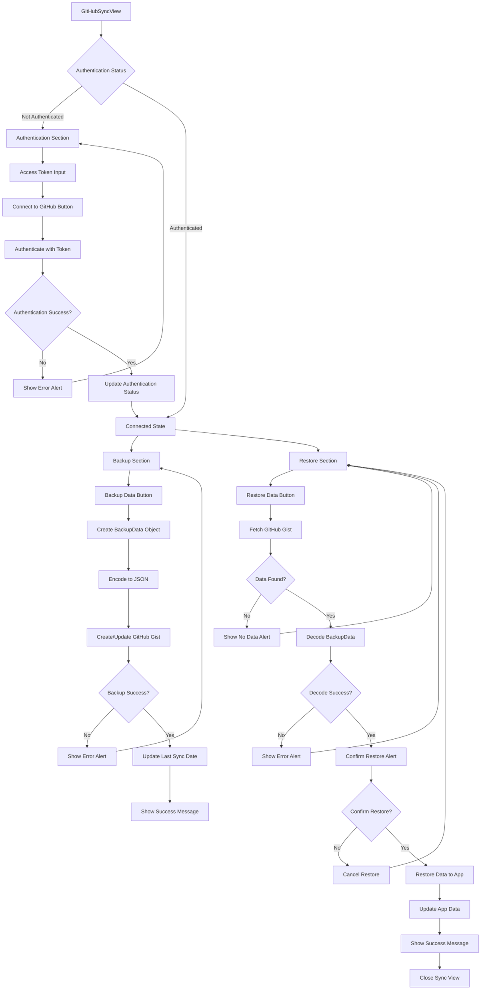

## iCloud Sync Flow

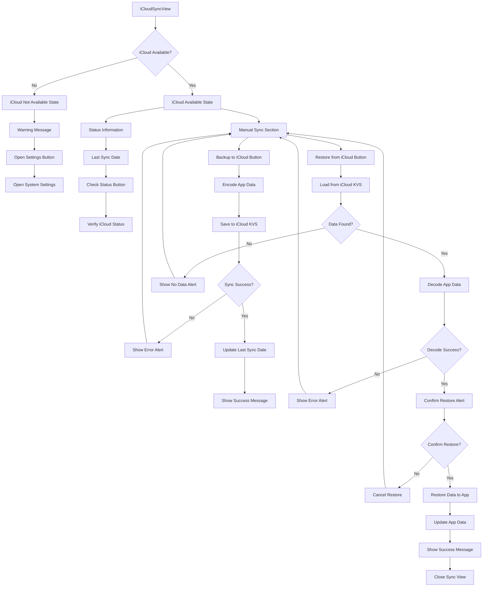

## Error Handling Flow

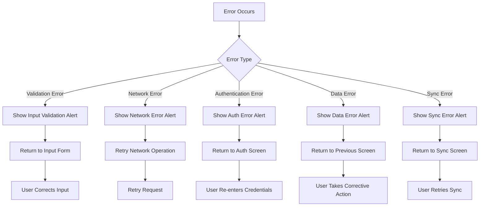

## Data Persistence Flow

```mermaid
flowchart TD
    A[Data Change Event] --> B{Change Type}
    B -->|User Data| C[Save to UserDefaults]
    B -->|List Data| D[Save to UserDefaults]
    B -->|Item Data| E[Save to UserDefaults]
    B -->|Sync Data| F[Save to Cloud]
    
    C --> G[Update registeredUsers Key]
    D --> H[Update lists_{userId} Key]
    E --> I[Update items_{listId} Key]
    F --> J[GitHub Gist or iCloud KVS]
    
    G --> K[Data Persisted Locally]
    H --> K
    I --> K
    J --> L[Data Persisted to Cloud]
    
    K --> M[Trigger UI Update]
    L --> N[Trigger Sync Status Update]
    
    M --> O[Refresh Related Views]
    N --> P[Update Last Sync Date]
```

## Performance Optimization Flow

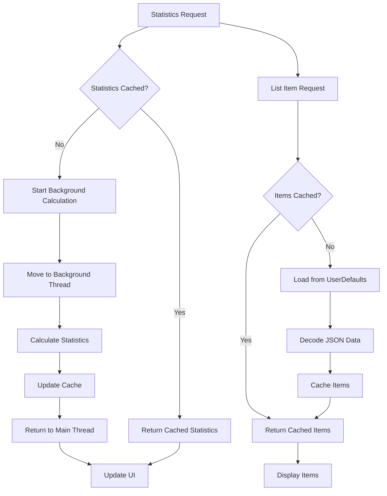

## Complete User Journey Examples

### New User Journey
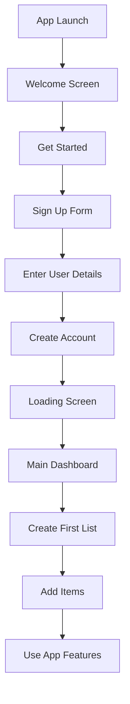

### Returning User Journey
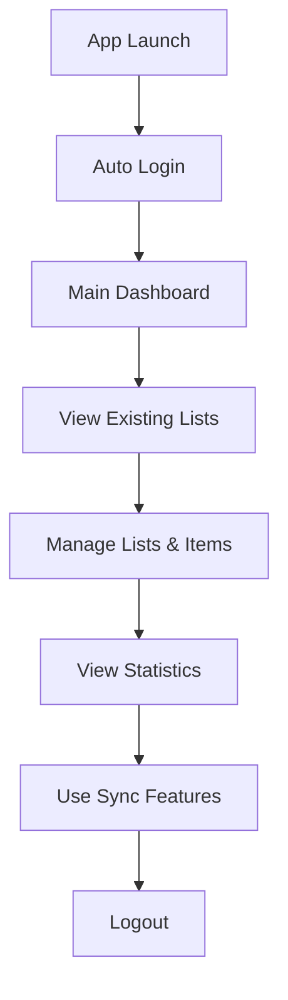

### Data Backup Journey
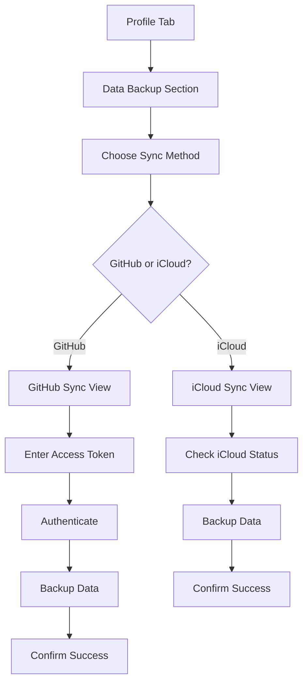

---

**MultiPurposeApp v1.0.0** - Comprehensive user flow documentation for all possible navigation paths and interactions.  
*Last Updated: July 31, 2025* 